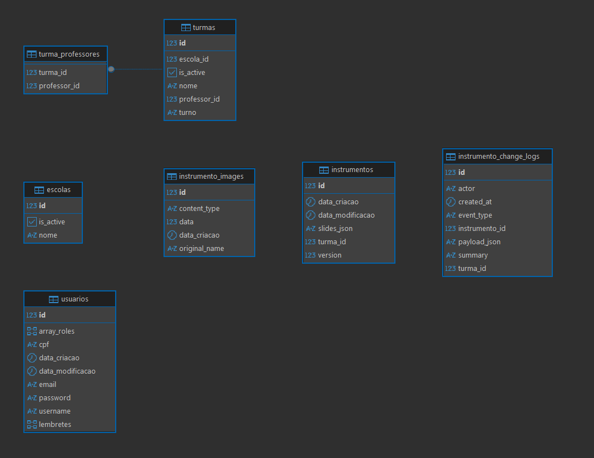

# Backend OBECI Platform (API REST)

API REST da Plataforma OBECI, responsável por autenticação/autorização e por operações de domínio (usuários, escolas, turmas) e persistência do “Instrumento” (slides) com suporte a colaboração em tempo real via WebSocket (STOMP).

Base URL (local): http://localhost:9090

--------------------------------------------------------------------------------

## 1. Visão Geral

### Propósito

Fornecer uma API central para a plataforma OBECI, permitindo:

- Autenticação e autoatendimento do usuário logado
- Gestão (CRUD) de usuários (admin)
- Gestão (CRUD) de escolas e turmas
- Persistência e carregamento do Instrumento (documento de slides por turma)
- Colaboração em tempo real no Instrumento via WebSocket (STOMP)

### Principais funcionalidades

- Login com JWT (HS256) e cookie HttpOnly (com fallback por header Authorization)
- Controle de acesso por roles (ADMIN, PROFESSOR)
- CRUD REST para escolas, turmas e usuários
- Upload e download de imagens do Instrumento
- Log de alterações do Instrumento (REST) + updates em tempo real (WebSocket)

--------------------------------------------------------------------------------

## 2. Tecnologias Utilizadas

- Java 21
- Spring Boot 3.5.7
- Spring Web (REST)
- Spring Security (autenticação/autorização)
- Spring Data JPA / Hibernate
- PostgreSQL (runtime)
- H2 (testes)
- Maven (wrapper: mvnw / mvnw.cmd)
- WebSocket + STOMP (spring-boot-starter-websocket, spring-security-messaging)
- JWT: JJWT (io.jsonwebtoken)
- Bean Validation (jakarta.validation)
- Lombok
- Hypersistence Utils (arrays e utilitários Hibernate)

--------------------------------------------------------------------------------

## 3. Arquitetura do Projeto

### Organização de pacotes (visão geral)

- org.obeci.platform.controllers
  - Controllers REST e controller STOMP (WebSocket)
- org.obeci.platform.services
  - Regras de negócio e integração com repositórios
- org.obeci.platform.repositories
  - Spring Data JPA repositories
- org.obeci.platform.entities
  - Entidades JPA (Usuario, Escola, Turma, Instrumento, etc.)
- org.obeci.platform.dtos
  - DTOs de request/response para contratos REST
- org.obeci.platform.dtos.collab
  - DTOs para colaboração (WebSocket e log)
- org.obeci.platform.configs
  - Configurações (Security, JWT, CORS, WebSocket, ExceptionHandler, etc.)
- org.obeci.platform.exceptions
  - Exceções de domínio (ex.: DuplicateTurmaException)

### Padrões adotados

- REST (controllers com rotas sob /api e /auth)
- DTOs para entradas (Create/Update) e respostas específicas (ex.: InstrumentoDto)
- JPA/Hibernate para persistência
- Autenticação stateless com JWT
- Autorização baseada em roles (hasRole)
- Colaboração em tempo real via STOMP (destinos /app, /topic, /user/queue)

Observação: o projeto não segue Clean Architecture estrita; a separação principal é por camadas (controller/service/repository).

--------------------------------------------------------------------------------

## 4. Pré-requisitos

- Java 21 (JDK)
- Maven (opcional, pois há Maven Wrapper no repositório)
- PostgreSQL (para execução local em perfil dev)
- Docker: A definir (não há arquivos Docker/Docker Compose neste repositório)

--------------------------------------------------------------------------------

## 5. Configuração do Ambiente

### Perfis

- dev (padrão)
- prod

Arquivos relevantes:

- src/main/resources/application.yml (base + perfil padrão dev)
- src/main/resources/application-dev.yml
- src/main/resources/application-prod.yml

### Banco de dados

Perfil dev:

- URL: 
- Usuário: 
- Senha:

Perfil prod (via variáveis de ambiente com defaults definidos no YAML):

- OBECI_DB_URL 
- OBECI_DB_USERNAME 
- OBECI_DB_PASSWORD 

JPA / Hibernate:

- spring.jpa.hibernate.ddl-auto = update
  - Atenção: update é útil em desenvolvimento, mas pode ser arriscado em produção.

### Variáveis de ambiente (principais)

- SPRING_PROFILES_ACTIVE
  - dev (padrão) ou prod
- APP_JWT_SECRET
  - Obrigatória em produção (require-secret=true)
- OBECI_DB_URL, OBECI_DB_USERNAME, OBECI_DB_PASSWORD
  - Usadas no perfil prod

### CORS e cookies

Configurações em app.cors e app.auth.cookie nos arquivos application-*.yml.

Em produção (cookies cross-site), normalmente se usa:

- cookie secure=true
- same-site=None
- allow-credentials=true

--------------------------------------------------------------------------------

## 6. Como Executar o Projeto

### Execução local (dev)

1) Suba o PostgreSQL e crie o banco coesterdb (ou ajuste o application-dev.yml).

2) Execute o backend:

~~~bash
./mvnw spring-boot:run
~~~

No Windows, alternativamente:

~~~powershell
./mvnw.cmd spring-boot:run
~~~

### Execução com profile prod

Defina as variáveis e execute com o profile prod:

~~~powershell
$env:SPRING_PROFILES_ACTIVE = "prod"
$env:APP_JWT_SECRET = "coloque-um-segredo-com-pelo-menos-32-caracteres"
./mvnw.cmd spring-boot:run
~~~

### Docker

A definir. Não há Dockerfile ou docker-compose.yml neste repositório.

--------------------------------------------------------------------------------

## 7. Autenticação e Segurança

### Tipo de autenticação

JWT (HS256) com:

- Cookie HttpOnly (nome configurável; padrão: token)
- Header Authorization: Bearer (compatibilidade)

O filtro JwtRequestFilter tenta, nesta ordem:

1) Authorization: Bearer <token>
2) Cookie HttpOnly (token)

Se o token estiver inválido ou expirado, o backend adiciona Set-Cookie para limpar o cookie.

### Como obter e utilizar o token

1) Faça login em POST /auth/login.
2) O backend retorna:
   - Set-Cookie: token=... (HttpOnly)
   - Corpo JSON com token e username

O cliente pode:

- Usar cookie (recomendado, especialmente em produção)
- Ou enviar Authorization: Bearer <token>

### Headers HTTP necessários

- Content-Type: application/json (para requests com JSON)
- Authorization: Bearer <token> (quando não estiver usando cookie)

### Autorização (roles)

Regras principais (SecurityConfiguration):

- POST /auth/register: somente ADMIN
- /api/usuarios/**: somente ADMIN
- /api/escolas/**:
  - GET autenticado
  - POST/PUT/DELETE somente ADMIN
- /api/turmas/**:
  - GET autenticado
  - POST/PUT/DELETE somente ADMIN
- /auth/me:
  - GET permitido, mas retorna 401 se não autenticado
  - PUT requer autenticação
- /auth/me/lembretes/**: autenticado
- Demais rotas: autenticado

Observação: em Spring Security, roles geralmente viram authorities com prefixo ROLE_. O projeto usa hasRole("ADMIN") / hasRole("PROFESSOR").

--------------------------------------------------------------------------------

## 8. Endpoints da API

### Convenções

- Todas as rotas REST ficam em /auth ou /api
- Porta padrão: 9090

### Autenticação e autoatendimento (AuthController)

Base: /auth

- POST /auth/login
  - Descrição: autentica email/senha e emite JWT (cookie + corpo)
  - Auth: pública

Request (JSON):

~~~json
{
  "email": "admin@exemplo.com",
  "password": "minhaSenha" 
}
~~~

Response 200 (JSON) + Set-Cookie:

~~~json
{
  "token": "eyJhbGciOiJIUzI1NiIsInR5cCI6IkpXVCJ9...",
  "username": "Admin"
}
~~~

- POST /auth/logout
  - Descrição: expira o cookie de autenticação
  - Auth: pública
  - Response: 200 (texto)

- GET /auth/me
  - Descrição: retorna dados do usuário logado
  - Auth: permitida, mas retorna 401 se não autenticado

Response 200 (JSON):

~~~json
{
  "username": "Admin",
  "email": "admin@exemplo.com",
  "arrayRoles": ["ADMIN"]
}
~~~

- PUT /auth/me
  - Descrição: atualiza dados do próprio usuário; se mudar email, reemite JWT e atualiza cookie
  - Auth: autenticado

Request (JSON) exemplo (campos opcionais):

~~~json
{
  "username": "Professor João (Atualizado)",
  "email": "joao.novo@escola.com",
  "password": "novaSenha123",
  "cpf": "12345678900"
}
~~~

Response 200 (JSON) exemplo (e, se email mudar, também Set-Cookie):

~~~json
{
  "username": "Professor João (Atualizado)",
  "email": "joao.novo@escola.com",
  "arrayRoles": ["PROFESSOR"]
}
~~~

- GET /auth/me/lembretes
  - Descrição: lista lembretes do usuário autenticado
  - Auth: autenticado

Response 200 (JSON):

~~~json
[
  "Lembrar de atualizar o Instrumento da Turma A",
  "Reunião com coordenação às 14h"
]
~~~

- POST /auth/me/lembretes
  - Descrição: adiciona um lembrete
  - Auth: autenticado

Request (JSON):

~~~json
{ "text": "Comprar materiais para a aula" }
~~~

- PUT /auth/me/lembretes/{index}
  - Descrição: atualiza lembrete pelo índice
  - Auth: autenticado

- DELETE /auth/me/lembretes/{index}
  - Descrição: remove lembrete pelo índice
  - Auth: autenticado

- POST /auth/register
  - Descrição: registra um novo usuário
  - Auth: somente ADMIN

Request (JSON):

~~~json
{
  "username": "Professor João",
  "email": "joao@escola.com",
  "password": "senha123",
  "cpf": "12345678900",
  "arrayRoles": ["PROFESSOR"]
}
~~~

Response 200: retorna a entidade Usuario (inclui campos como id, username, email, cpf, arrayRoles e datas).

### Usuários (UsuarioController)

Base: /api/usuarios (somente ADMIN)

- GET /api/usuarios
  - Descrição: lista usuários

- GET /api/usuarios/{id}
  - Descrição: obtém usuário por id (retorna Optional no corpo)

- POST /api/usuarios
  - Descrição: cria usuário (admin)

- PUT /api/usuarios/{id}
  - Descrição: atualiza usuário

- DELETE /api/usuarios/{id}
  - Descrição: remove usuário

- GET /api/usuarios/role/{role}?q=termo
  - Descrição: lista usuários por role, com busca opcional

- GET /api/usuarios/professores
  - Descrição: lista professores em formato resumido

Response 200 (JSON) exemplo:

~~~json
[
  { "id": 10, "username": "Professor João", "email": "joao@escola.com" },
  { "id": 11, "username": "Professora Ana", "email": "ana@escola.com" }
]
~~~

### Escolas (EscolaController)

Base: /api/escolas

- GET /api/escolas
  - Descrição: lista escolas (autenticado)

- GET /api/escolas/{id}
  - Descrição: obtém escola por id (retorna Optional no corpo)

- POST /api/escolas
  - Descrição: cria escola (somente ADMIN)

Request (JSON):

~~~json
{
  "nome": "Escola Municipal Exemplo",
  "cidade": "São Paulo",
  "isActive": true
}
~~~

Response 200 (JSON):

~~~json
{
  "id": 1,
  "nome": "Escola Municipal Exemplo",
  "isActive": true
}
~~~

Observação: o campo cidade é validado no DTO, mas não é persistido na entidade atual.

- PUT /api/escolas/{id}
  - Descrição: atualiza escola (somente ADMIN)

- DELETE /api/escolas/{id}
  - Descrição: remove escola (somente ADMIN)

- GET /api/escolas/ativo/{isActive}
  - Descrição: lista escolas por status

- GET /api/escolas/nome/{nome}
  - Descrição: busca por nome contendo o valor

### Turmas (TurmaController)

Base: /api/turmas

- GET /api/turmas
  - Descrição: lista todas as turmas (autenticado)

- GET /api/turmas/mine
  - Descrição: lista turmas visíveis ao usuário atual
  - Regra:
    - ADMIN: todas
    - PROFESSOR: turmas onde professorIds contém o id do usuário
    - Outras roles: lista vazia

- GET /api/turmas/{id}
  - Descrição: obtém turma por id (retorna Optional no corpo)

- POST /api/turmas
  - Descrição: cria turma (somente ADMIN)

Request (JSON):

~~~json
{
  "escolaId": 1,
  "professorIds": [10, 11],
  "turno": "Manhã",
  "nome": "Turma A",
  "isActive": true
}
~~~

Response 200 (JSON):

~~~json
{
  "id": 100,
  "escolaId": 1,
  "professorIds": [10, 11],
  "turno": "Manhã",
  "nome": "Turma A",
  "isActive": true
}
~~~

- PUT /api/turmas/{id}
  - Descrição: atualiza turma (somente ADMIN)

- DELETE /api/turmas/{id}
  - Descrição: remove turma (somente ADMIN)

- GET /api/turmas/escola/{escolaId}
  - Descrição: lista turmas por escola

- GET /api/turmas/professor/{professorId}
  - Descrição: lista turmas por professor

### Instrumentos (InstrumentoController)

Base: /api/instrumentos (autenticado)

- GET /api/instrumentos/turma/{turmaId}
  - Descrição: busca o instrumento da turma
  - Response 200 (InstrumentoDto) ou 404

Response 200 (JSON) exemplo:

~~~json
{
  "id": 500,
  "turmaId": 100,
  "slidesJson": "[{\"id\":1,\"textBoxes\":[],\"images\":[]}]",
  "version": 21
}
~~~

- POST /api/instrumentos/turma/{turmaId}
  - Descrição: cria/substitui slides do instrumento da turma
  - Request body: JSON livre (JsonNode)
  - Response: InstrumentoDto

- PUT /api/instrumentos/turma/{turmaId}
  - Descrição: atualiza slides do instrumento da turma
  - Request body: JSON livre (JsonNode)
  - Response: InstrumentoDto

Request (JSON) exemplo (estrutura simplificada):

~~~json
[
  {
    "id": 1,
    "content": "",
    "textBoxes": [
      { "id": 1, "x": 120, "y": 80, "content": "Título", "fontSize": 24 }
    ],
    "images": [
      { "id": 1, "x": 50, "y": 50, "width": 200, "height": 120, "src": "/api/instrumentos/images/9" }
    ]
  }
]
~~~

- POST /api/instrumentos/images
  - Descrição: upload de imagem (multipart/form-data; campo file)
  - Response 200: URL relativa da imagem

Response 200 (texto) exemplo:

~~~
/api/instrumentos/images/9
~~~

- GET /api/instrumentos/images/{id}
  - Descrição: download binário da imagem (Content-Type conforme armazenado)

- GET /api/instrumentos/turma/{turmaId}/changes?limit=50
  - Descrição: retorna histórico recente de alterações (log)
  - Response 200: lista de InstrumentoChangeLogDto

Response 200 (JSON) exemplo:

~~~json
[
  {
    "id": 1,
    "instrumentoId": 500,
    "turmaId": 100,
    "actor": "admin@exemplo.com",
    "eventType": "SNAPSHOT_UPDATE",
    "summary": "Editou texto no Slide 1",
    "payloadJson": null,
    "createdAt": "2026-02-05T13:10:12"
  }
]
~~~

### WebSocket (colaboração em tempo real)

Handshake WebSocket:

- GET /ws

Destinos STOMP (InstrumentoWsController):

- Cliente envia para: /app/instrumentos/update
- Broadcast do servidor: /topic/instrumentos/{turmaId}
- Erros por usuário: /user/queue/instrumentos/errors

Mensagem enviada pelo cliente (InstrumentoWsUpdateRequest) exemplo:

~~~json
{
  "turmaId": 100,
  "slides": [{ "id": 1, "textBoxes": [], "images": [] }],
  "expectedVersion": 21,
  "clientId": "c2f7b0f2-3b8d-4a5b-9e07-7a3c0f2d1a10",
  "summary": "Atualizou imagem no Slide 1",
  "eventType": "SNAPSHOT_UPDATE"
}
~~~

Broadcast do servidor (InstrumentoWsUpdateBroadcast) exemplo:

~~~json
{
  "instrumentoId": 500,
  "turmaId": 100,
  "slides": [{ "id": 1, "textBoxes": [], "images": [] }],
  "version": 22,
  "updatedBy": "admin@exemplo.com",
  "updatedAt": "2026-02-05T13:12:33",
  "clientId": "c2f7b0f2-3b8d-4a5b-9e07-7a3c0f2d1a10",
  "changeLog": {
    "id": 2,
    "instrumentoId": 500,
    "turmaId": 100,
    "actor": "admin@exemplo.com",
    "eventType": "SNAPSHOT_UPDATE",
    "summary": "Atualizou imagem no Slide 1",
    "payloadJson": null,
    "createdAt": "2026-02-05T13:12:33"
  }
}
~~~

--------------------------------------------------------------------------------

## 9. Tratamento de Erros

### Padrão de erros

O projeto centraliza parte do tratamento em GlobalExceptionHandler.

- Erro simples:

~~~json
{ "error": "Mensagem de erro" }
~~~

- Erro de validação (Bean Validation):

~~~json
{
  "error": "Validation failed",
  "errors": [
    { "field": "email", "message": "Email é obrigatório" },
    { "field": "password", "message": "Senha deve ter pelo menos 6 caracteres" }
  ]
}
~~~

Observação: alguns endpoints (ex.: login/me) retornam texto simples em 401. Se for necessário padronizar 100% para JSON, isso pode ser evoluído.

### Códigos HTTP utilizados (principais)

- 200 OK: sucesso
- 400 Bad Request: validação e RuntimeException (fallback)
- 401 Unauthorized: não autenticado / credenciais inválidas
- 404 Not Found: recurso não encontrado (em alguns endpoints)
- 409 Conflict: duplicidade de turma (DuplicateTurmaException)

--------------------------------------------------------------------------------

## 10. Testes

### Tipos de testes

- Testes automatizados com spring-boot-starter-test (integração/contexto)
- spring-security-test para cenários de segurança

### Como executar

~~~bash
./mvnw test
~~~

No Windows:

~~~powershell
./mvnw.cmd test
~~~

--------------------------------------------------------------------------------

## 11. Boas Práticas e Observações

- JWT secret em produção
  - Em prod, app.jwt.require-secret=true e APP_JWT_SECRET deve estar definido.

- Cookies cross-site
  - Para frontend e backend em domínios diferentes, use secure=true, same-site=None e allow-credentials=true.

- DDL automático
  - spring.jpa.hibernate.ddl-auto=update pode ser perigoso em produção. Considere migrações (Flyway/Liquibase) em evolução futura.

- Respostas Optional
  - Alguns endpoints retornam Optional no corpo; se for necessário, pode-se padronizar para 404 quando vazio.

--------------------------------------------------------------------------------

## 12. Licença

Uso interno.

